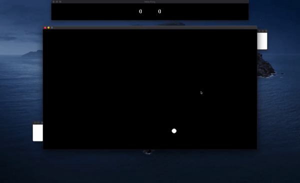

# MetaPong
### An SDL2/C++ remake of Pong, using actual OS windows as paddles and UI elements

  

---
# Gameplay

  

The player uses up and down arrow keys to control the position of the paddle. Just like the original Pong, the goal is to prevent the ball from going through your side and to bounce it into the opponent's side.

Each game is 10 rounds. Whoever has most points by the end of the rounds wins. The game will keep going but points will not be calculated again until the player restarts.

You can press Q to quit or R to restart at any time.

# Purpose and Outcome
I made this game over the course of three weeks using minimal tutorials as a personal challenge in order to put my C++ knowledge to the test. I was coming in from a C background and had only just gotten myself familiar with C++ by having taken an online course. This project was great because it taught me so many C++ concepts in practice such as namespaces, classes, inheritance, polymorphism, and using external libraries, amongst many other smaller ideas.

This was also my first time using a graphics library (SDL2) and it was a great way for me to get familiar with managing my own rendering and texturing — albeit at a higher level.

Most importantly, it was fun! Seeing my own Mac windows moving up and down and colliding with a virtual ball was both hilarious and very satisfying.

# Running it Yourself
I purposefully left this section towards the end. The reason is because I could not find a consistent way to compile and ship my program as a simple executable, not even just for Mac. However, I do have a [Build](Build) folder which should work on all Intel Macs, provided that you use [Homebrew](https://brew.sh/) to install `sdl2 sdl2_image sdl2_ttf`. Alternatively, you could download the whole project and use the .xcodeproj file to build it yourself by adding the correct SDL libraries based on your own include directories.

# Possible Improvements
And finally, it is time to reflect. While I believe that the game turned out looking fantastic for the time I put into it and the knowledge I had at the start of this journey, it certainly has room for improvement. Here are some things that could be fixed/changed if I ever decided to revisit the project.

1. The codebase is not the cleanest I have written. It is not well documented, the variable namings are not always consistent, I have far too many cyclical header includes for comfort, there are some hacky solutions for the paddle texturing and I did not break functionalities down into small enough classes. Refactoring the code would do it some good.
2. There is no main menu. The overall user experience is not the greatest. The controls are not explained, nor is the meta nature of the game. It could certainly be fleshed out more.
3. This is more of a cool feature, but I would like the player to physically be able to drag the paddle and have that collide with the ball. I tried implementing that early on but converting the screen position to one that could be used by the ball for collision seemed to much of a hassle at the time.

# Final Thoughts
As I mentioned before, I learned a lot from this project. I am now far more confident in my C++ abilities. Having had the scholastic Java background for OOP helped, but getting to better grasp the way C++ handled classes and inheritance was certainly a curve.

If anyone reading this does end up building this and running it on their machine, please feel free to open an issue and let me know what you thought. Also, the code is 'open-source'. Any contribution to it is highly welcome. I could learn a thing or two :)
